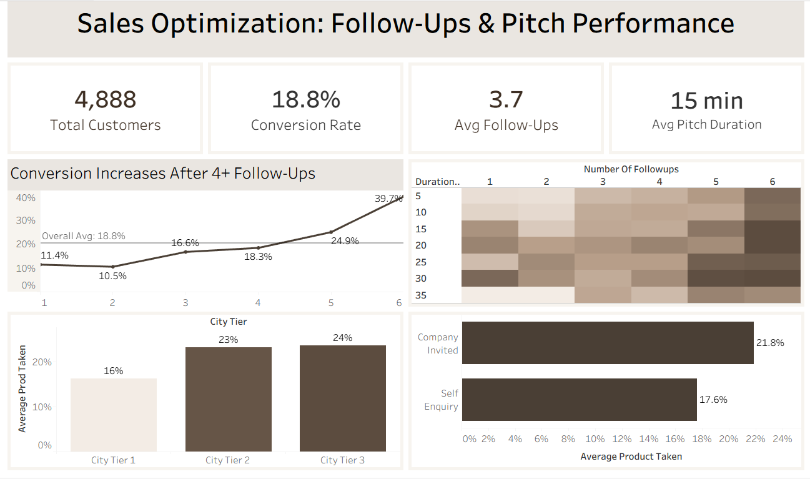

# Sales Conversion Optimization Analysis

Sales funnel analysis identifying drivers of customer conversion and optimizing outreach strategy using SQL, Excel, and Tableau.

## Project Overview

This project analyzes sales funnel data from a tourism company to understand how follow-up cadence, pitch duration, product positioning, and outreach channels influence customer conversion.

The objective of the analysis is to identify opportunities to improve sales performance and optimize the outreach strategy used by the sales team.

## Business Problem

The company’s sales team is pitching tourism packages to prospective customers, but conversion rates vary widely across customer segments and sales interactions.

Understanding how follow-up timing, pitch strategy, and outreach channels influence purchasing decisions can help improve overall sales performance and increase conversion rates.

## Dataset

The dataset contains customer demographic information, travel preferences, sales interactions, and purchasing outcomes.

Key attributes include customer age, monthly income, number of follow-ups, pitch duration, contact type, product tier pitched, and conversion status.

## Key Findings

• Conversion rate increases significantly after 5 follow-ups  
• Six follow-ups produced the highest conversion rate (~40%)  
• Basic packages convert significantly higher than premium tiers  
• Company-invited leads outperform self-enquiry leads  
• City Tier 2 and Tier 3 markets demonstrate stronger conversion performance

## Business Recommendations

• Implement a minimum 5-touch follow-up cadence per lead  
• Keep sales pitches within the optimal 20–30 minute range  
• Position Basic packages as the primary entry-level offering  
• Increase proactive outreach to drive higher engagement  
• Focus marketing and sales expansion on Tier 2 and Tier 3 markets

## Dashboard

Interactive Tableau Dashboard:  
[https://public.tableau.com/views/SalesOptimizationFollow-UpsPitchPerformance/Dashboard1](https://public.tableau.com/views/Notfinished_17708818836920/Dashboard1?:language=en-US&:sid=&:redirect=auth&:display_count=n&:origin=viz_share_link)

## Tools Used

SQL – data exploration and analysis  
Excel – data cleaning and aggregation  
Tableau – dashboard development and visualization  
Gamma – executive presentation development

## Project Structure

sales-dashboard.png – Tableau dashboard screenshot  
Sales-Optimization-Analysis.pdf – executive slide presentation  
README.md – project documentation
